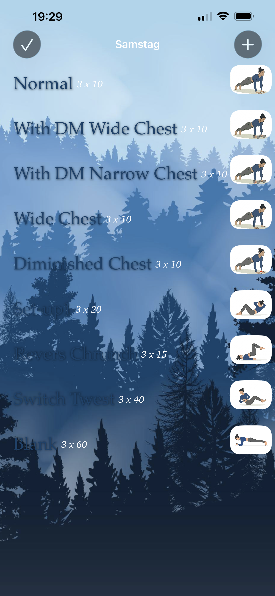
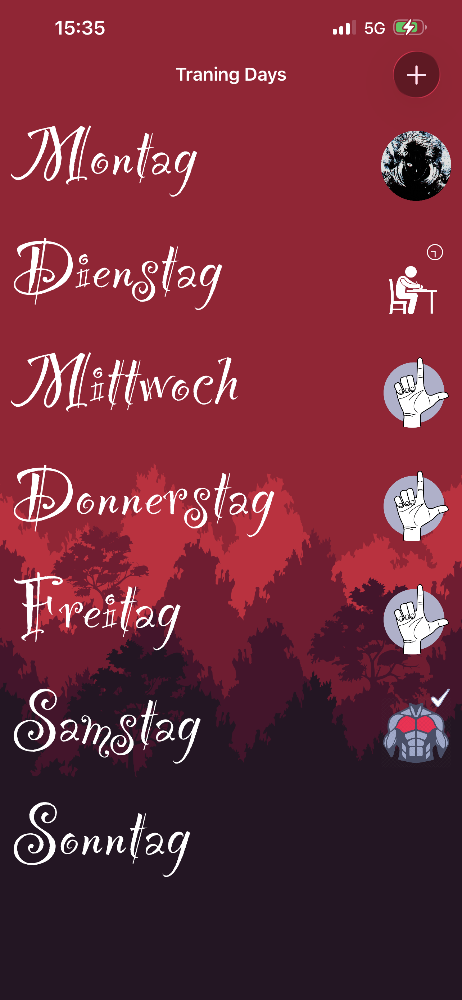
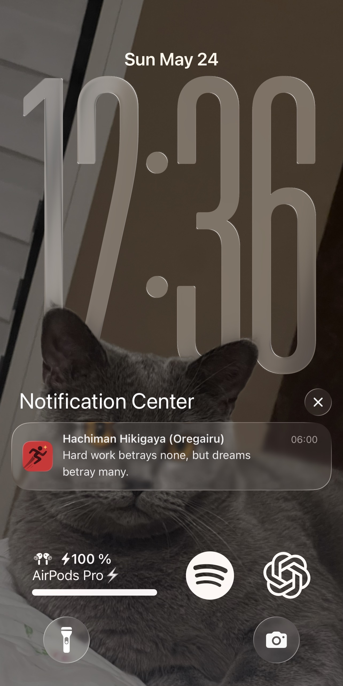

# Plani — Personal Workout Tracker for iOS

A personal iOS workout tracking app built with Swift and UIKit, developed alongside the [iOS & Swift - The Complete iOS App Development Bootcamp](https://www.udemy.com/course/ios-13-app-development-bootcamp/learn/lecture/10929514?start=0#overview) by **Angela Yu** — my first steps into iOS development after a background in Android with Java.

> This app was built entirely for personal use. It is highly specific to my own training preferences and workflow. It is not a general-purpose fitness app — it was designed around exactly what I personally needed.

---

## Background 

I started programming on Android using Java, then decided to explore iOS development. I took the **[iOS Course](https://www.udemy.com/course/ios-13-app-development-bootcamp/learn/lecture/10929514?start=0#overview)** by **Angela Yu** on Udemy that gave me the foundation to start building real apps.

During the learning with the course I started building Plani — a workout tracker tailored to my own training routine — to apply what I had learned on a real personal project.

The app works. It has been used personally on a weekly basis. Development has been paused mainly because of an Apple Developer account limitation — the free tier only allows a 7-day signing period before the app needs to be rebuilt and re-run on the device. Publishing to the App Store would remove this limitation, but that was not the goal at this stage.

---

## What the App Does

### Launch Screen
When the app opens, one of up to 10 different videos plays on the launch screen, automatically selected based on the current day — a small personal touch before the main screen loads.

Due to copyright reasons, the original videos I used personally are not included in this repository. Instead, a default placeholder video (`Video1.mp4`). Launcher screen example: 

You can replace it or add your own videos. Simply name them `Video1.mp4` through `Video10.mp4` and place them in the `Videos/` folder — the app will detect them automatically and rotate through them day by day.

---

### Training Days Screen

The main screen shows all 7 days of the week from Monday to Sunday written in a custom decorative font. Each day shows an image next to the day name representing its current status:

- **No image** — today with no muscle group assigned yet, or a future day
- **Muscle group image** — today's day with a muscle group assigned but not yet completed
- **Muscle group image + checkmark** — today's day fully completed
- **L-shaped hand image** — the day passed without training, standing for Lost
- **Person-at-desk icon** — the day was marked as Exam, meaning you had to study
- **Dark circular character** — the day was marked as Redemption, meaning you did another physical activity instead
  
The + button in the top right opens the Daily Tasks panel. 

You can only interact with today's training day. All other days are locked.

---

### Lost / Redemption / Exam States

If a training day passes with an assigned muscle group but without being completed, the app automatically marks that day with a **Lost** badge — an L-shaped hand image. Tapping a Lost day gives you two options:

- **Exam** — marked with a person-at-desk icon with a timer above it, meaning you had to study that day
- **Redemption** — marked with a dark circular character image, meaning you did some other physical activity that day such as swimming or another sport

These states are detected and applied automatically every time the app is opened, by scanning all past days of the current week.

### Training Day Screen

When you tap today's day, the training screen opens. It moves through three stages as you progress:

**Stage 1 — Empty**
No muscle group assigned yet. The screen shows an animated red creature — the Behelit Egg from Berserk. Tapping it or the + button opens the muscle group picker. A full training day requires either a main muscle group (Chest, Back, Shoulders, Triceps, Biceps, or Legs) + an ab circuit (A, B, or C), or Running alone which counts as a full day. Main muscle groups can only be assigned once per week — already used groups are hidden from the list.

**Stage 2 — In Progress**
Once assigned, all exercises appear as a list with the exercise name, sets × reps target, and a small illustration. A ghost character at the bottom right opens the removal alert — tapping it lets you remove an entire muscle group from the day.

**Stage 3 — Completed**
Once all exercises are done the ghost disappears, and on the main screen a checkmark appears next to that day confirming it as fully completed.

 

---

### Exercise Detail

Tapping any exercise opens a half-screen sheet to track individual sets — this is separate from completing the day itself. Each set appears as a row with a picker wheel to log reps and the target (Aim for X). A blue checkmark appears when a set is done.

**Unlocked — Red Lock**
When all sets meet the target, a red lock icon appears next to the exercise name — finished but still editable, meaning you can still change the values in the picker.

**Locked — Green Shield**
Tapping the red lock turns it into a green shield with a checkmark — the picker wheels become non-interactive and no values can be changed anymore. Tapping the green shield again unlocks it back to the red lock.

---

### Daily Tasks

Tapping the + button on the main screen slides up the Daily Tasks panel from the bottom. When empty, an animated atom sphere in the top right opens the New Element Setup screen — an overlay where an animated character peeks in from the top. Fill in three fields: Routine Name, Amount Daily, and Extension Type — a live preview updates as you type. Tap the character to submit.

After adding an item it appears in the panel with a picker wheel starting at 0. Scroll the picker to match your daily goal and the circle on the right automatically becomes a checkmark — confirming it is done for today. All items reset back to 0 the next day. To delete an item swipe left to reveal the red Delete button.

---

### Notifications

The app requests notification permission on first launch and schedules motivational reminders throughout the month. The notification messages are custom-written quotes — some from anime, some from other sources — chosen personally to keep motivation up. Notifications are seeded from a JSON file bundled with the app and are only re-scheduled when the pending queue is empty, avoiding duplicates across app relaunches.

---
## Technical Details

- **Language:** Swift
- **UI Framework:** UIKit
- **Persistence:** Local PropertyList files + CoreData scaffolding
- **Architecture:** Manager-ViewController pattern with delegate protocols
- **Notifications:** UNUserNotificationCenter with a bundled JSON seed file
- **Video playback:** AVPlayer for launch screen video rotation
  
---

## Known Limitations

- Data stored locally via plist files — no iCloud sync or backup
- Not production ready — built and tested for personal use only
- Code has mixed English/German naming and some spelling inconsistencies
- Some UI methods from the course no longer exist in newer iOS versions, causing extra design challenges
- Minor UI warnings and layout issues exist, nothing breaking
  
---

## Learning Journey

Coming from an Android and Java background, iOS felt like a completely different world. A big thank you to **Angela Yu** and her **[iOS & Swift Bootcamp](https://www.udemy.com/course/ios-13-app-development-bootcamp/learn/lecture/10929514?start=0#overview)** — despite some outdated parts, it taught the core concepts that made everything click.

The best decision was to stop following tutorials and start building something real. Plani is the result of that — a personal problem turned into a personal project. It is imperfect, it has rough edges, and it was never meant to be anything other than a tool for one person. But it works, it was used, and it taught more than any tutorial ever could.

---

## Attribution

Exercise, UI icons and GIFs sourced from:
- [Flaticon - Muscles](https://www.flaticon.com/free-icon/muscles_14228743)
- [Flaticon - Hand](https://www.magnific.com/es/icono/mano_11434781)
- [Alpha Coders - Wallpaper](https://wall.alphacoders.com/big.php?i=943215)
- [Giphy](https://giphy.com)

---